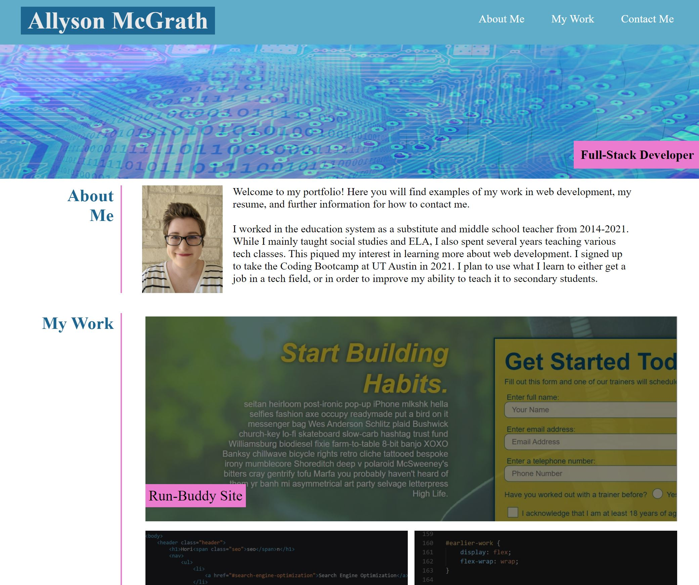

# HTML/CSS-Portfolio Website

## Description

This is a project where we were given a mockup and required to create our own portfolio site based on the image and accompanying instructions. The main purpose was to demonstrate understanding of how to use HTML and CSS to structure a website. 

The first part of the project required using HTML to create the skeleton of the site. We needed to have a navigation that linked to three sections (About Me, My Work, and Contact Me). We then had to create those sections, with an image of ourselves, a paragraph of background, linked images to our work, and how to contact us.

The next part required adding CSS to add design aspects and positioning. This meant adding classes and ids to the HTML. This project required an understanding of flexbox in order to position elements on the page. We also had to add pseudoclasses to elements such as the "my work" images and the navigation buttons.

The last part was adding media queries to make the page responsive for different screen sizes.

## Installation

To install this project, you can clone the repository by using the command prompt

$ git clone https://github.com/AllysonMcGrath/cbcchallenge2.git

Detailed instructions for cloning GitHub repositories can be found [here.](https://docs.github.com/en/github/creating-cloning-and-archiving-repositories/cloning-a-repository-from-github/cloning-a-repository)

## Usage

When displaying correctly, website should look like the image below:

You can find the deployed site [here.](https://allysonmcgrath.github.io/cbcchallenge2/)

Use standard git commands within this repository.

Examples:

$ git mv index.html ../
$ git add .
$ git commit -m "commit description"
$ git push origin main

## Credits

Trilogy Education Services, LLC, a 2U, Inc. brand

[Coding Boot Camp at UT](https://github.com/the-Coding-Boot-Camp-at-UT)

## License

MIT License

Copyright (c) 2021 Allyson McGrath

Permission is hereby granted, free of charge, to any person obtaining a copy
of this software and associated documentation files (the "Software"), to deal
in the Software without restriction, including without limitation the rights
to use, copy, modify, merge, publish, distribute, sublicense, and/or sell
copies of the Software, and to permit persons to whom the Software is
furnished to do so, subject to the following conditions:

The above copyright notice and this permission notice shall be included in all
copies or substantial portions of the Software.

THE SOFTWARE IS PROVIDED "AS IS", WITHOUT WARRANTY OF ANY KIND, EXPRESS OR
IMPLIED, INCLUDING BUT NOT LIMITED TO THE WARRANTIES OF MERCHANTABILITY,
FITNESS FOR A PARTICULAR PURPOSE AND NONINFRINGEMENT. IN NO EVENT SHALL THE
AUTHORS OR COPYRIGHT HOLDERS BE LIABLE FOR ANY CLAIM, DAMAGES OR OTHER
LIABILITY, WHETHER IN AN ACTION OF CONTRACT, TORT OR OTHERWISE, ARISING FROM,
OUT OF OR IN CONNECTION WITH THE SOFTWARE OR THE USE OR OTHER DEALINGS IN THE
SOFTWARE.
